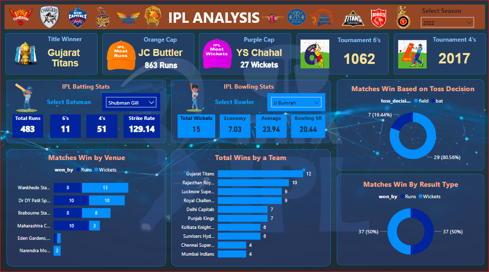

# IPL Analysis Project

Welcome to my IPL Analysis project! I've analyzed IPL data from various seasons to provide insights into different aspects of the tournament.

## Analysis Overview
In this project, I've focused on several key metrics to understand the performance of teams and players across different IPL seasons. Here's what my analysis includes:

### 1. Seasonal Analysis
- **Title Winner**: The team that won the IPL title in each season.
- **Orange Cap**: The player with the highest runs scored in each season.
- **Purple Cap**: The player with the highest wickets taken in each season.
- **Sixes and Fours**: The number of sixes and fours hit by players in each season.

### 2. Player Performance
- **Batsman Stats**: Total runs, sixes, fours, and strike rate of batsmen in each season.
- **Bowler Stats**: Total wickets, economy rate, average, and bowling strike rate of bowlers in each season.

### 3. Team Performance
- **Matches Win by Venue**: Analysis of matches won by teams at different venues.
- **Total Wins by a Team**: The overall number of wins by each team across all seasons.

### 4. Match Analysis
- **Matches Win Based on Toss Decision**: Analysis of matches won by teams based on their toss decision (fielding or batting).
- **Matches Win by Result Type**: Distribution of matches won by runs or wickets.

## How to Explore
1. **Clone the Repository**: Clone this repository to your local machine.
2. **Open the Power BI File**: Open the Power BI file named "IPL analysis 2008 to 2022.pbix"
3. **Navigate the Dashboard**: Interact with the visualizations to explore the analysis in detail.
4. **Share Your Feedback**: I value your feedback! Feel free to reach out with any questions or suggestions.

## Screenshots
Below are screenshots of my IPL Analysis dashboard showcasing various visualizations:

## Tools Used
For this analysis, I utilized the following tools:
- **Power BI**: Used to create visualizations and dashboards for analyzing IPL data.
- **PostgreSQL**: Utilized for managing and querying the IPL data. SQL queries are available in the file "sql queries ipl data.sql".

## Data Source
The IPL data used for this analysis was downloaded from Kaggle. You can find the dataset [here](https://www.kaggle.com/datasets/biswajitbrahmma/ipl-complete-dataset-2008-2022). The dataset is available in CSV format.
